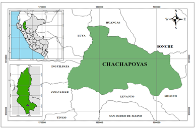
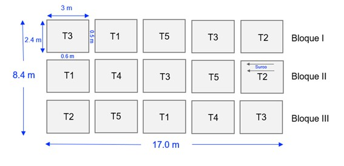

# Título

Análisis agronómico y fisiológico de cinco cultivares de beterraga (Beta vulgaris) bajo las condiciones agroclimáticas de Chachapoyas, Amazonas

# Problema de investigación  

La provincia de Chachapoyas, Amazonas, presentan condiciones óptimas para la producción de diversas hortalizas, caracterizada por presentar temperaturas frescas y suelos fértiles. Dentro de las hortalizas, el cultivo de la beterraga tiene un gran potencial y para obtener buenos rendimientos es necesario utilizar semillas de cultivares adaptados a las condiciones agroclimáticas de Chachapoyas el cual influirá en el comportamiento agronómico y fisiológico así como en la calidad de la raíz. En base a lo descrito anteriormente se plantea la siguiente pregunta de la investigación: ¿Cuáles serán las respuestas agronómicas y fisiológicas del cultivo de cinco cultivares de beterraga bajo las condiciones agroclimáticas de Chachapoyas, Amazonas?

# Objetivos

## Objetivo general

●	Determinar las respuestas agronómicas y fisiológicas de cinco cultivares de beterragas bajo las condiciones agroclimáticas de Chachapoyas, Amazonas.

## Objetivos específicos 

●	Evaluar el comportamiento fenológico de cinco cultivares de beterraga bajo las condiciones agroclimáticas de Chachapoyas.

●	Analizar los parámetros agronómicos de cinco cultivares de beterraga bajo las condiciones agroclimáticas de Chachapoyas

●	Analizar los parámetros fisiológicos de cinco cultivares de beterraga bajo las condiciones agroclimáticas de Chachapoyas

●	Determinar los parámetros de calidad de raíz de cinco cultivares de beterraga bajo las condiciones agroclimáticas de Chachapoyas

# Antecedentes de la investigación

La remolacha o beterraga (Beta vulgaris L.), perteneciente a la familia Chenopodiaceae, tiene su origen en las zonas costeras del Mediterráneo. El género Beta se divide en tres grupos principales: Corollines, Vulgares y Patellares. De la sección vulgare provienen todas las variedades cultivadas actualmente, las cuales presentan una amplia diversidad, abarcando desde las remolachas rojas empleadas como hortalizas, hasta las variedades forrajeras y las utilizadas para la producción de azúcar (Frese et al., 2001).
La investigación señala que la remolacha necesita alrededor de 20 l/m² de agua durante su etapa inicial, siendo crucial el riego frecuente en los primeros 20 días tras la siembra para evitar la pérdida de semillas. El agua influye directamente en el peso y valor nutricional del cultivo, pero su manejo es complejo para los agricultores, ya que depende de factores como el tipo de suelo, el clima y la profundidad de las raíces (COAG, 2013).
La remolacha generalmente necesita entre 3 000 y 6 500 m³ de agua por hectárea, según la época de siembra y el tipo de suelo donde se cultive. El riego debe aplicarse cada 10 a 12 días, considerando la etapa del cultivo y la presencia de lluvias. No obstante, algunos expertos sugieren que los riegos deben ser frecuentes, pero con volúmenes moderados, ya que el exceso de agua puede generar problemas en el desarrollo del cultivo (FAO, 2006).
En América Latina se produce principalmente la variedad cruenta para consumo de mesa (Montes et al., 2020). En el país, la disponibilidad de cultivares comerciales de betarraga es limitada, y la información sobre estos es escasa, lo que dificulta una elección informada al momento de la siembra. Entre los cultivares más comunes se encuentran ‘Early Wonder Tall Top’ y ‘Detroit Dark Red Morse’s Strain’. El primero es una variedad semi-precoz, con raíces redondas y follaje largo, mientras que el segundo es de maduración tardía, presenta raíces de forma redonda a ovalada y un follaje corto, pero con buena capacidad de conservación. También se cultivan otras variedades como ‘Crosby Egyptian’, que destaca por su precocidad, raíces aplanadas u ovaladas y hojas largas; y el ‘Green Top Bunching’, una variedad semi-precoz con raíces ovaladas y follaje de tamaño intermedio. Cabe resaltar que todos estos cultivares tienen un potencial de rendimiento superior a 30 toneladas por hectárea, cifra considerablemente mayor al promedio nacional, que se sitúa en aproximadamente 11 toneladas por hectárea (Castillo, 2004). En zonas de alta altitud como la jalca y la puna, caracterizadas por praderas muy húmedas y frecuentes heladas, se realizaron experimentos con remolacha azucarera y forrajera en localidades entre los 3564 y 3887 m s.n.m. En estos estudios, la remolacha azucarera mostró resistencia a las heladas, pero bajos rendimientos (menos de 6.6 t/ha) debido al estrés hídrico. En contraste, la remolacha forrajera, cultivada con riego complementario a 3718 m s.n.m., alcanzó altos rendimientos hasta 62.95 t/ha, demostrando mejor adaptación a las condiciones de altitud con manejo adecuado del agua (Rojas, 2018).
A nivel nacional la remolacha o beterraga tiene un valor S/. 4.50 . En el “mercado modelo” en Chachapoyas, Amazonas el precio de 1kg de beterraga o remolacha está el valor de S/. 5.00.

# Hipótesis

 Al menos uno de los cultivares de beterraga evaluados presentará un mejor comportamiento agronómico y fisiológico, así como una mayor calidad de raíz, bajo las condiciones agroclimáticas de Chachapoyas, Amazonas.
 
# Metodología

El presente trabajo de investigación se realizará en la Universidad Nacional Toribio Rodríguez de Mendoza, en el distrito de Chachapoyas, provincia de Chachapoyas, región Amazonas (Perú) a una altitud de 2428 m.s.n.m y con las siguientes coordenadas geográficas de 6°13’35” S y 77°52’27” O. 

## Población, muestra y muestreo

### Población

La población estará constituida por todas las plantas de los cinco cultivares de betarraga que se cultivarán en el área de estudio.

### Muestra

La muestra estará compuesta por 150 plantas, 10 plantas por cada unidad experimental en el cual estrán distribuidos los cinco cultivares comerciales o experimentales de beterra.

### Muestreo 

Se utilizará un muestreo aleatorio simple, evaluando al menos 10 plantas por unidad experimental para asegurar la representatividad estadística de las observaciones.

## Variables de estudio

### Variables independientes

-	Cultivares de beterraga

-	Condiciones edafoclimáticas de Chachapoyas, Amazonas

### Variables dependientes

Parámetros fenológicos

-	Días a la emergencia

-	Día de la aparición de hojas verdaderas

-	Días de formación del bulbo (raíz engrosada)

-	Días a la cosecha

Descriptores morfológicos

-	Altura de planta

-	Número de hojas

Parámetros fisiológicos

-	Fotosíntesis neta

-	Conductancia estomática

-	Tasa de transpiración

-	Eficiencia del uso del agua

-	Fluorescencia de la clorofila a

-	Contenido de clorofila a

-	Contenido de clorofila b

-	Contenido de carotenoides totales

Indicadores de rendimiento

-	Peso de raíz por planta

-	Longitud de raíz

-	Diámetro de raíz

-	Rendimiento comercial de raís (tn/ha)

Parámetros de calidad

-	% de materia seca

-	Contenido de proteínas totales

-	Contenido de aminoácidos totales

-	Contenido de almidón

-	Contenido de azúcares totales

-	Contenido de fenoles totales

-	Contenido de betacianinas

## Métodos

### Diseño de la investigación  

Se instalará un experimento, bajo un diseño de bloques completamente al azar (DBCA), conformado por cinco tratamientos distribuídos en tres bloques, con un total de 15 unidades experimentales.

**Tabla 01**.*Tratamientos del experimento*

| Tratamiento | Descripción |
|-------------|-------------|
| T1          | Cultivar 1  |
| T2          | Cultivar 2  |
| T3          | Cultivar 3  |
| T4          | Cultivar 4  |
| T5          | Cultivar 5  |

### Distribución de los tratamientos

### Características del campo experimental

**Tabla 02**. *Dimensiones del campo experimental*

| Categoría                | Variable                          | Valor |
|--------------------------|-----------------------------------|--------|
| Área experimental        | Largo del área experimental       | 17.0   |
| Área experimental        | Ancho del área experimental       | 8.4    |
| Área experimental        | Área total del área experimental  | 142.8  |
| Unidad experimental (UE) | Número de UE                      | 15     |
| Unidad experimental (UE) | Largo de la UE                    | 3.0    |
| Unidad experimental (UE) | Ancho de la UE                    | 2.4    |
| Unidad experimental (UE) | Área neta de la UE                | 7.2    |
| Bloques                  | Número                            | 3      |
| Bloques                  | Largo                             | 17.0   |
| Bloques                  | Ancho                             | 2.4    |
| Bloques                  | Distancia entre bloques           | 0.6    |
| Surcos                   | Número de surcos por UE           | 4      |
| Surcos                   | Largo                             | 3.0    |
| Surcos                   | Distanciamiento entre surcos      | 0.6    |
| Calles                   | Ancho de las calles               | 0.5    |

### Modelo aditivo lineal 

 Yij = μ + τᵢ + βⱼ + εᵢⱼ
Donde:
	Yij= unidad experimental que recibe el tratamiento i en el bloque j
	μ= media de los tratamientos
	τi= efecto del i-ésimo tratamiento
	βi= efecto del j-ésimo bloque
	εij= error experimental
	
### Análisis de suelo

Se recolectarán submuestras para determinar pH, MO, P, K, textura, entre otros parámetros físicos y químicos que nos presenta el análisis de suelo.

### Preparación del terreno

Se realizará una limpieza del terreno, labranza del suelo, mullido, nivelación y surcos.

### Siembra

En cuanto a la siembra se llevará a cabo manualmente, considerando 30 cm
entre plantas y 40 cm entre surcos.

### Fertilización

Se aplicarán 2 fertilizaciones basados: una al momento de la siembra (NPK 15-15-15) y otra al macollamiento (urea y KCl), siempre teniendo en cuenta requerimientos del cultivo.

### Control de malezas

Manual y/o mecánico, según densidad de infestación se tendrá en cuenta un Manejo Integrado de Malezas (MIM)

### Control fitosanitario

Monitoreo constante para detección oportuna de plagas/enfermedades y aplicación de productos autorizados, haciendo uso de una Manejo Integrado de Plagas y Enfermedades (MIPE).

### Cosecha

Se realizará cuando las plantas alcancen su madurez fisiológica, aproximadamente entre los 75 y 90 días después de la siembra, ello va a depender del cultivar.

## Parámetros por evaluar

Para la evaluación de las variables, se.

### Parámetros fenológicos

a.	Días a la emergencia
Para su evaluación…
b.	Día de la aparición de hojas verdaderas
Se realizará un . 
c.	Días de formación del bulbo (raíz engrosada)
Se registrará el número de...
d.	 Días a la cosecha
Se realizará un . .

### Descriptores morfológicos

a.	Altura de planta 
b.	Número de hojas

### Parámetros fisiológicos

a.	Fotosíntesis neta
b.	Conductancia estomática
c.	Tasa de transpiración
d.	Eficiencia del uso del agua
e.	Fluorescencia de la clorofila a
f.	Contenido de clorofila a
g.	Contenido de clorofila b
h.	Contenido de carotenoides totales

### Indicadores de rendimiento

a.	Peso de raíz por planta
b.	Longitud de raíz
c.	Diámetro de raíz
d.	Rendimiento comercial de raís (tn/ha)

### Parámetros de calidad

a.	% de materia seca
b.	Contenido de proteínas totales
c.	Contenido de aminoácidos totales
d.	Contenido de almidón
e.	Contenido de azúcares totales
f.	Contenido de fenoles totales
g.	Contenido de betacianinas

##  Cronograma

**Tabla 03**: *Periodo del tiempo en el que se realizará la investigación*

| **Categoría**            | **Variable**                     | **Valor** |
| ------------------------ | -------------------------------- | --------- |
| Área experimental        | Largo del área experimental      | 17.0      |
| Área experimental        | Ancho del área experimental      | 8.4       |
| Área experimental        | Área total del área experimental | 142.8     |
| Unidad experimental (UE) | Número de UE                     | 15        |
| Unidad experimental (UE) | Largo de la UE                   | 3.0       |
| Unidad experimental (UE) | Ancho de la UE                   | 2.4       |
| Unidad experimental (UE) | Área neta de la UE               | 7.2       |
| Bloques                  | Número                           | 3         |
| Bloques                  | Largo                            | 17.0      |
| Bloques                  | Ancho                            | 8.4       |
| Bloques                  | Distancia entre bloques          | 0.6       |
| Surcos                   | Número de surcos por UE          | 4         |
| Surcos                   | Largo                            | 3.0       |
| Surcos                   | Distanciamiento entre surcos     | 0.6       |

## Análisis de datos

Los datos serán organizados en una planilla Excel, posteriormente, una vez analizado el cumplimiento de los supuestos de normalidad y homogeneidad de varianzas, los datos serán sometidos a un análisis de varianza (ANOVA). Si se observan diferencias significativas entre los tratamientos, se llevará a cabo la prueba de comparación de medios de Tukey. Todos los análisis estadísticos se llevarán a cabo utilizando el software R.

# Referencias bibliográficas

Castillo, C. (2004). Cultivo de betarraga en la costa central. https://repositorio.inia.gob.pe/server/api/core/bitstreams/b9b2dc4c-db14-4494-b7c7-729a71e4f0e6/content

COAG. (2013). Servicios de Estadística, Estudios y Planificación Agrícola. https://bibliotecadigital.jcyl.es/es/catalogo_imagenes/grupo.cmd?path=10114988

FAO. (2006). Guía para la determinación de los requerimientos de agua de cultivos. https://openknowledge.fao.org/server/api/core/bitstreams/f3660258-d07f-487e-b3c1-01661c83cb16/content

Frese, L., Hodgkin, T., & Spillane, C. (Eds.). (2001). Broadening the Genetic Base of Crop Production. International Plant Genetic Resources Institute (IPGRI) Food and Agriculture Organization of the United Nations (FAO) CABI. https://doi.org/10.1079/9780851994116.0000

Montes, N., Cisneros López, M. E., Díaz Franco, A., Espinosa Ramírez, M., & Ãlvarez Ojeda, M. G. (2020). Remolacha azucarera (*Beta vulgaris* L.) como cultivo alternativo en el noreste de Tamaulipas, México: Factores agrotecnologicos. Agricultura Sociedad y Desarrollo, 17(3), 547-568. https://doi.org/10.22231/asyd.v17i3.1371

Rojas, C. (2018). Desarrollo de la “remolacha azucarera” y de la “remolacha forrajera” *Beta vulgaris* L. (Amaranthaceae) sembradas directamente en zonas altoandinas del norte del Perú. Arnaldoa, 25(3). https://doi.org/10.22497/arnaldoa.253.25311

